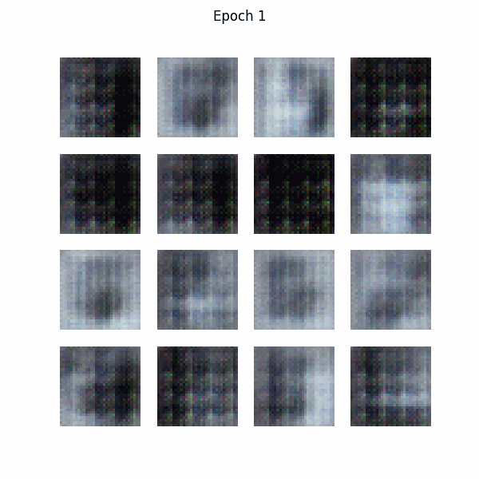
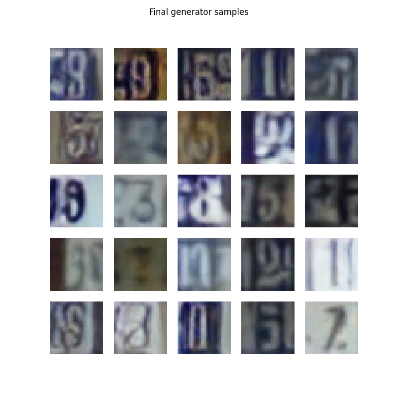

# DCGAN on SVHN

Implementation of a Deep Convolutional GAN trained on the [Street View House Numbers (SVHN)](http://ufldl.stanford.edu/housenumbers/) dataset. Adapted from the [TensorFlow DCGAN tutorial](https://www.tensorflow.org/tutorials/generative/dcgan), which originally uses MNIST.

## Training progress



## Final samples (epoch 50)



## Changes from the original tutorial

| | Original (MNIST) | This version (SVHN) |
|---|---|---|
| Dataset | `tf.keras.datasets.mnist` | `tensorflow_datasets` (`svhn_cropped`) |
| Image shape | `(28, 28, 1)` grayscale | `(32, 32, 3)` RGB |
| Generator layers | `7→14→28` | `4→8→16→32` (one extra layer) |
| Generator output | 1 channel | 3 channels |
| Discriminator input | `(28, 28, 1)` | `(32, 32, 3)` with extra strided conv |
| Display | `cmap='gray'` | RGB, rescaled `[-1, 1]` → `[0, 1]` |

## Setup

```bash
pip install tensorflow tensorflow-datasets imageio matplotlib
```

```bash
jupyter notebook dcgan_svhn.ipynb
```
